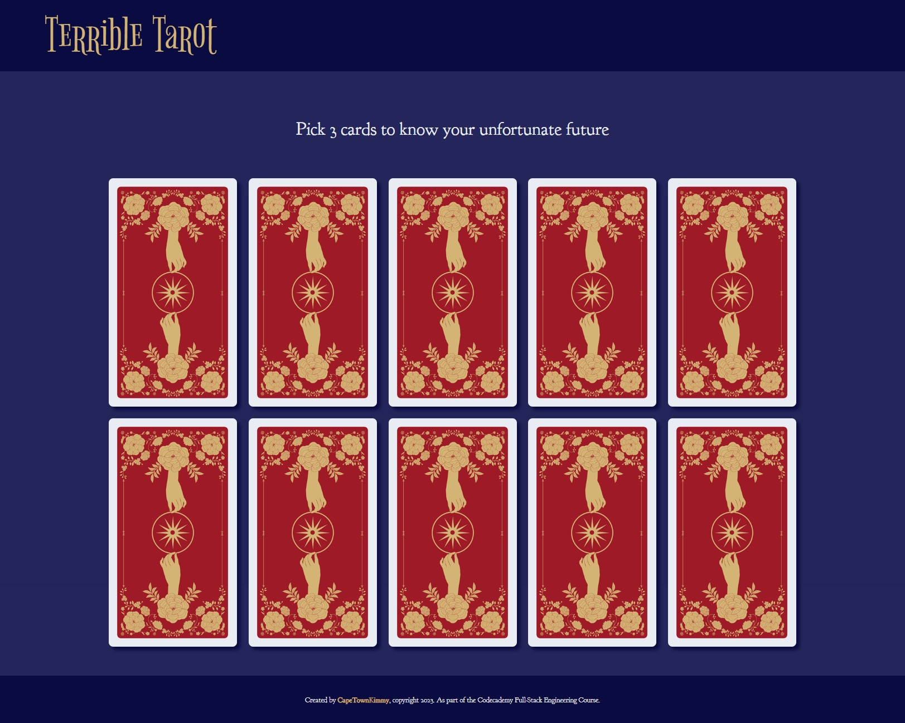
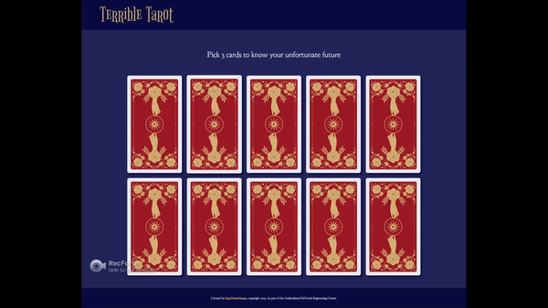
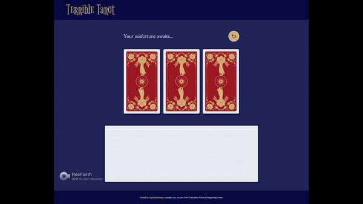

# **Terrible-Tarot**
A *Codecademy* Portfolio Project.

For this project, I had to build a message generator program. Everytime a user runs the program a new, randomised message needs to display.

### The Project Objectives:
* Build a message generator program using JavaScript.
* Use Git version control.
* Use command line.
* Develop locally on your computer.

---
I opted to build a tarot card reading game in which the user selects three cards. The cards are then flipped over to reveal images as well as the users 'fortune'. I have tried to make the fortunes as non-sensical as possible. Offense is not intended.

---
Have your own fortune told now! [Terrible Tarot]()

---
### Features:
* Interactive card selection.

---

* Animated card flip to reveal your personalised fortune.

---
## Software & Skills:
---
* HTML
* CSS
* JavaScript
* Figma
* VS Code
* Git
* GitHub
